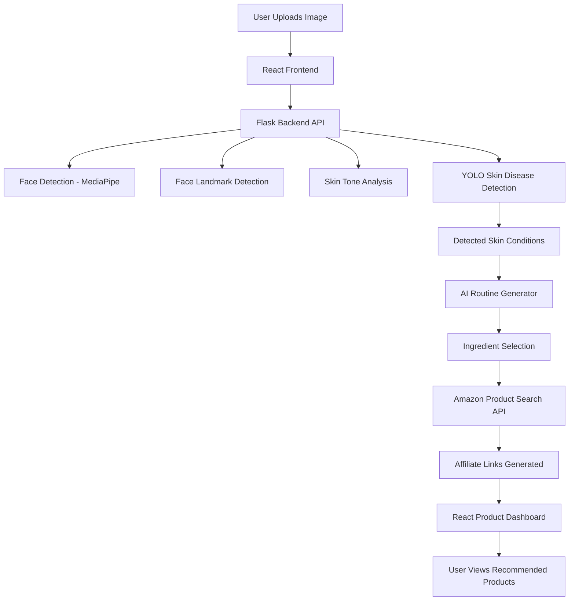
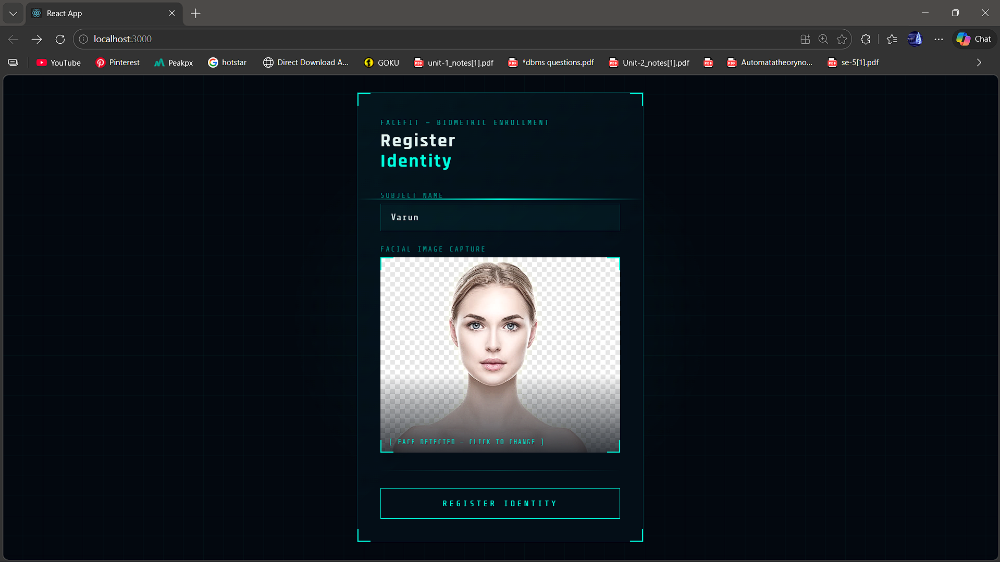
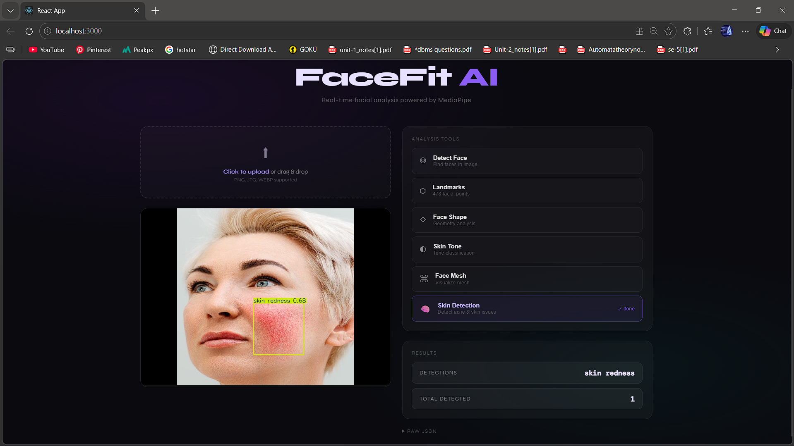
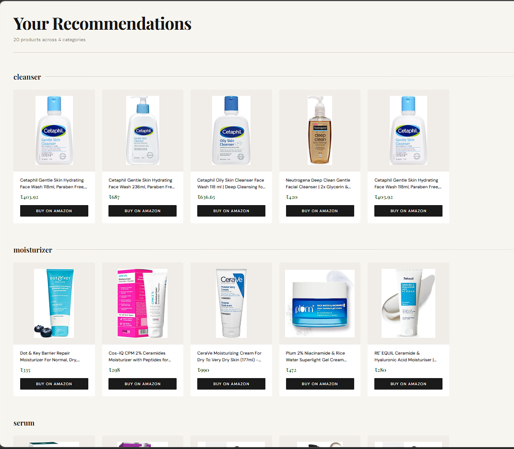

# FaceFit AI – AI Skin Analysis & Product Recommendation System


FaceFit AI is an **AI-powered skincare analysis platform** that detects facial skin conditions using computer vision and deep learning, then recommends suitable skincare products based on the analysis.

The system integrates **YOLO-based skin disease detection, facial analysis, and an automated product recommendation engine with Amazon affiliate integration**.

---

# Key Features

### AI Skin Condition Detection

Uses a trained **YOLO deep learning model** to detect skin issues such as:

* Acne
* Dark Circles
* Blackheads
* Whiteheads

---

### Facial Analysis

The system performs multiple analyses on the uploaded image:

* Face detection
* Facial landmark detection (468 landmarks)
* Face shape estimation
* Skin tone detection

---

### Personalized Skincare Routine

Based on detected skin issues, the system generates a **custom skincare routine** including:

**Morning Routine**

* Cleanser
* Serum
* Moisturizer
* Sunscreen

**Night Routine**

* Treatment serum
* Skin repair products

---

### Product Recommendation Engine

The system automatically searches Amazon for skincare products using the recommended ingredients.

Features:

* Ingredient-based product search
* Amazon product recommendations
* Affiliate link generation

---

### Interactive Dashboard

The React frontend displays:

* Skin analysis results
* AI-generated skincare routine
* Recommended products
* Amazon purchase links

---

# Project Architecture



---

# Screenshots

## Upload & Registration Page

Users upload their face image for AI analysis.



---

## AI Skin Detection

YOLO detects skin conditions like acne and dark circles.



---

## Skin Analysis Results

The system shows facial information including:

* Skin tone
* Face shape
* Detected conditions


---

## AI Skincare Routine

Based on detected conditions, the system generates a personalized routine.


---

## Product Recommendations

The application recommends skincare products from Amazon.



---

# Demo

Below is a demo showing the system analyzing a face image and recommending products.


---

# Tech Stack

### Frontend

* React.js
* HTML
* CSS
* JavaScript

### Backend

* Flask (Python)

### AI & Computer Vision

* YOLOv8
* OpenCV
* MediaPipe

### Database

* MongoDB Atlas

### APIs

* Amazon SERP API
* Amazon Associates Affiliate Program

---

# Installation

## Clone Repository

```bash
git clone https://github.com/YOUR_USERNAME/FaceFit-AI.git
cd FaceFit-AI
```

---

## Backend Setup

```bash
cd backend
python -m venv venv
venv\Scripts\activate
pip install -r requirements.txt
python app.py
```

Backend runs on:

```
http://127.0.0.1:5000
```

---

## Frontend Setup

```bash
cd frontend
npm install
npm start
```

Frontend runs on:

```
http://localhost:3000
```

---

# Environment Variables

Create a `.env` file inside backend:

```
SERP_API_KEY=your_serp_api_key
MONGO_URI=your_mongodb_connection
OPENAI_API_KEY=your_api_key
```

---

# Future Improvements

* Real-time webcam skin analysis
* Skin health score system
* Skin progress tracking
* AI dermatologist chatbot
* Mobile application

---

# Author

**Varun Reddy**

Python Developer | AI Enthusiast | Software Engineer

GitHub
https://github.com/varun339658

---

# License

This project is licensed under the MIT License.
